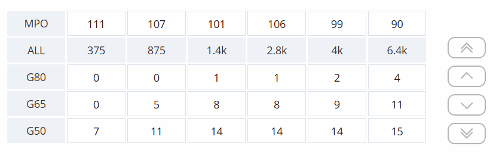
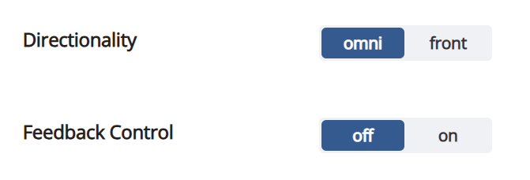
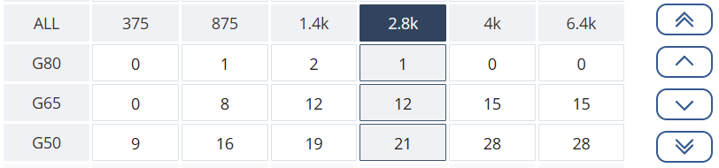

# :ear_with_hearing_aid: Hearing Program Project

## :memo: Your Task
You'll build a small application that simulates a real-world scenario. This isn't a pure algorithm problem; think of it as building part of a real product.
I'll give you the work in several steps (tasks), and you'll implement them one by one.

**Tech Stack:**
- Use Typescript and React
- You can use any AI coding tools or IDEs to help
- You're allowed to search online for help

## :hammer: What to Build

### Gain Table
- Make a table that displays numbers, representing `gain` data for a hearing program.
- Each number (cell) in the table should be clickable.
- When a cell is selected, the user (imagine an audiologist) can adjust the value up or down by 3 (for example, click `+3` or `-3`).

  

  **Example Data Structure:**
  ``` typescript
  gain = [
    [4, 16, 15, 6, 3, 0],
    [8, 19, 19, 11, 8, 4],
    [11, 22, 22, 16, 13, 8],
  ]
  ```

### Acoustic Settings
- Each program also has some "acoustic configuration" settings.
- For each setting, provide a switch or similar UI so the user can pick between several options.

  

### Undo/Redo Support
- After the user changes gain values or settings, they should be able to undo or redo their changes, just like in common apps.

### Batch Adjustments
- The user should be able to click on a row or column header in the gain table to select the whole row or column.
- When a row or column is selected, adjustments (+3/-3) apply to all cells in that row or column.
- Undo/redo should work for these batch changes as well.

  

### Multiple Programs
- There can be several "programs" at the same time.
- Each program has its own gain table and acoustic settings.
- The user should be able to switch between programs, and changes in one program shouldn't affect the others.
